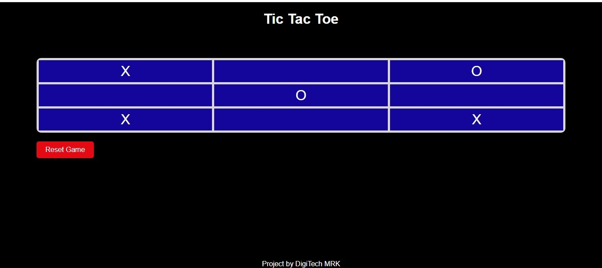

# Tic Tac Toe Game

## Overview
This is a simple Tic Tac Toe game built using HTML, CSS, and JavaScript. It allows two players to take turns making moves on a 3x3 grid until one player wins or the game ends in a draw.

## Features
- Responsive design: The game is designed to be playable on various screen sizes, including mobile devices.
- Player turn indication: The current player's turn is displayed at the top of the game board.
- Winner announcement: When a player wins, the game displays a message announcing the winner.
- Draw detection: If there are no more moves possible and no winner, the game announces a draw.

## Getting Started
To play the game, simply open the `index.html` file in a web browser.

## How to Play
1. The game starts with Player X making the first move.
2. Players take turns clicking on empty cells to place their mark (X or O).
3. The first player to get three of their marks in a row (horizontally, vertically, or diagonally) wins the game.
4. If all cells are filled and there is no winner, the game ends in a draw.

## Screenshots

## About
This project is developed by Muhammad Rameez from DigiTech MRK.

## License
This project is licensed under the MIT License. See the [LICENSE](LICENSE) file for details.
